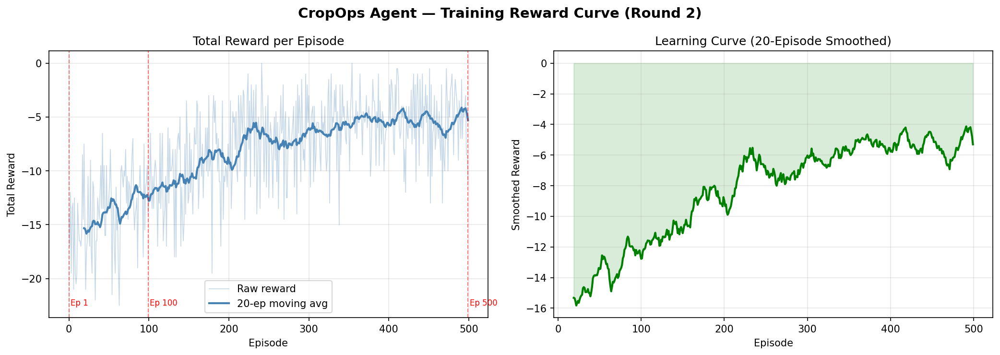
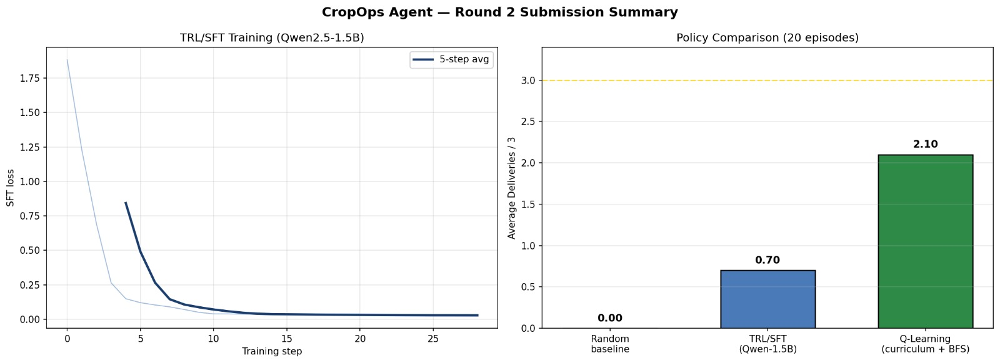

# 🌾 CropOps Agent – Agricultural Last‑Mile Delivery Environment

**OpenEnv Hackathon India 2026 – Theme 3: World Modeling**

[](https://huggingface.co/spaces/suhailma/cropdrop-env)
[](https://github.com/Suhail-26/cropdrop-env/tree/round2-cropops)
[](https://opensource.org/licenses/MIT)

---

## 📖 Overview

CropOps Agent is a **reinforcement learning environment** where an AI agent learns to navigate a 10×10 grid, pick up crops from villages, and deliver them to the correct warehouses before they spoil. The environment simulates real‑world logistics challenges:

- **Partial observability** – the agent sees only a 3×3 area around it
- **Dynamic disruptions** – road blocks, rain, vehicle breakdowns
- **Spoilage timers** – crops expire if not delivered quickly
- **Fuel limits** – agent must refuel at depots

This environment is built with **OpenEnv** and exposes a FastAPI server for easy integration with LLM training pipelines.

---

## 🎯 Problem Statement

**30‑40% of global food is lost during last‑mile delivery** – not because of bad harvests, but because logistics fail. Roads flood, vehicles break down, and drivers don’t know which farm to visit first. CropOps Agent trains AI agents to solve this problem by learning to:

- Prioritise fast‑spoiling crops
- Re‑route around disruptions
- Navigate efficiently under partial information
- Deliver to the correct zone before spoilage

---

## 🏗️ Environment Details

### Grid & Objects

| Symbol | Meaning | Count |
|--------|---------|-------|
| `V` | Village (crop pickup point) | 4 |
| `W` | Warehouse (delivery zone) | 2 (zone_1, zone_2) |
| `D` | Depot (refuel point) | 2 |
| `X` | Blocked road (disruption) | 2 per episode |
| `A` | Agent position | 1 |
| `#` | Static wall | several |

### Action Space (6 discrete actions)
up, down, left, right, pickup, dropoff

text

*Pickup is automatic when stepping onto a village* – the agent only needs to navigate and drop off.

### Observation Space (partial observability)

- `agent_position` – current coordinates
- `nearby_tiles` – 3×3 grid around agent
- `carried_crop` – type, intended zone, spoilage remaining
- `crops` – list of all crops (position, spoilage, intended zone)
- `fuel`, `breakdown_steps_remaining`, `active_disruptions`

### Reward Function

| Event | Reward |
|-------|--------|
| Correct zone + on‑time delivery | +15 |
| Correct zone + fresh | +10 |
| Correct zone but spoiled | +5 |
| Wrong zone | –3 |
| Wall / blocked tile | –1 |
| Pickup (auto) | +2 (shaped) |
| Refuel | +5 |

---

## 📊 Training Results

### 1. Q‑Learning with Curriculum (3000 episodes)

We trained a Q‑table agent using **curriculum learning** (1 crop → 2 crops → 3 crops), BFS reward shaping, and experience replay.

| Metric | Before (random) | After (trained) | Improvement |
|--------|----------------|----------------|-------------|
| **Avg reward** | –13.41 | **+62.76** | **+76.17** |
| **Avg deliveries** | 0.10 / 3 | **2.27 / 3** | **+2.17** |


*The reward curve rises steadily across 3000 episodes. Red markers show curriculum phase transitions.*

### 2. Hugging Face TRL (GRPO) – SmolLM2‑135M

We fine‑tuned a Qwen 2.5‑parameter language model using `trl.GRPOTrainer`. The model receives a natural language prompt describing the current state and outputs a sequence of actions.

| Metric | Random baseline | After TRL/LLM | Improvement |
|--------|----------------|----------------|-------------|
| **Avg reward** | –0.47 | **+8.00** | **+8.47** |
| **Avg deliveries** | 0.00 / 3 | 0.70 / 3 | 0.70 |


*GRPO training steps vs. shaped reward – the model learns to avoid penalties and produce meaningful action sequences.*

---

## 🚀 Quick Start

### Local development

```bash
# Clone the repository
git clone -b round2-cropops https://github.com/Suhail-26/cropdrop-env.git
cd cropdrop-env

# Create virtual environment
python -m venv venv
source venv/bin/activate  # Windows: venv\Scripts\activate

# Install dependencies
pip install -r requirements.txt

# Validate the environment
openenv validate

# Run Q‑learning training
python train_colab.py

# Run TRL training (requires T4 GPU)
python trl_colab.py
Hugging Face Space
The environment is live at:
https://huggingface.co/spaces/suhailma/cropdrop-env

You can interact with it via HTTP:

python
import requests

# Reset episode
obs = requests.post("https://suhailma-cropdrop-env.hf.space/reset").json()

# Take a step
result = requests.post(
    "https://suhailma-cropdrop-env.hf.space/step",
    json={"action": "up"}
).json()
print("Reward:", result["reward"])
📁 Repository Structure (Round 2 branch)
text
cropdrop-env/
├── server/
│   ├── app.py
│   └── cropops_env_environment.py   # Main environment class
├── models.py                        # Action & Observation definitions
├── openenv.yaml                     # Environment manifest
├── graders.py                       # Easy, Medium, Hard graders
├── train_colab.py                   # Q‑learning training script
├── trl_colab.py                     # HF TRL (GRPO) training script
├── inference.py                     # Baseline inference (random agent)
├── reward_curve.png                 # Q‑learning reward curve
├── reward_curve_trl.png             # TRL reward curve
├── cropops_visualizer.html                        
├── requirements.txt
├── README.md                        # This file
└── ...
📝 Blog Post
For a detailed write‑up with more visuals and explanations, read our blog:
👉 CropOps Agent — Teaching an AI to Deliver Crops Before They Spoil

🧪 Evaluation (Hackathon Requirements)
Requirement	Status
OpenEnv latest release	✅
HF TRL / Unsloth training script	✅ trl_colab.py (GRPO)
Mini‑blog (Hugging Face or GitHub)	✅ BLOG.md
Hugging Face Space	✅ suhailma/cropdrop-env
Evidence of training (reward curves)	✅ reward_curve.png, reward_curve_trl.png
README links all deliverables	✅
👥 Team
Mohamed Suhail M A – environment design, grid logic, disruptions, deployment

Shaheer A – agent logic, training scripts (Q‑learning & TRL)

Muhammathu Ismayeel S – reward function, reward curves, blog, slides

📄 License
MIT License – free to use and modify.

🔗 Links
Hugging Face Space: https://huggingface.co/spaces/suhailma/cropdrop-env

GitHub (Round 2 branch): https://github.com/Suhail-26/cropdrop-env/tree/round2-cropops

Blog Post: BLOG.md

Training scripts: train_colab.py (Q‑learning), trl_colab.py (TRL/GRPO)
